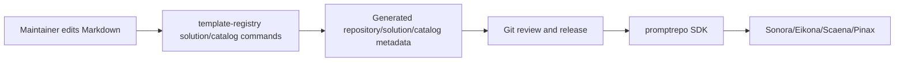

## Architecture

## Decisions

1. 中文是 source locale；英文为 reviewed adaptation。
2. 一级类目固定十二个 stable IDs；其他语义由 namespace tags 表达。
3. 每个 solution 使用独立版本和 body digest；不按模型复制内容。
4. Prompt 正文可人工编辑，结构化 metadata 必须由维护命令生成。
5. 首发内容覆盖常见跨场景任务，但 maturity 统一为 `first-support`，不冒充 mature。
6. 内容仓库不执行模型、不存凭据、不包含用户数据或运行证据。

## Verification

- 十二个类目均有一个 solution；每个包含 zh-CN 与 en。
- 所有 solution 有 category/job/artifact/modality 等 tags、capabilities、rights、maturity。
- `template-registry catalog build --repository . --json` 成功。
- `template-registry catalog validate --repository . --json` 成功。
- `openspec validate --all --strict` 成功。

## Rollback

Catalog release 使用 Git commit/tag 固定。内容问题通过新版本或回退到前一 commit 处理，不修改历史 tag。仓库在 license/signing 决策完成前保持 private。
