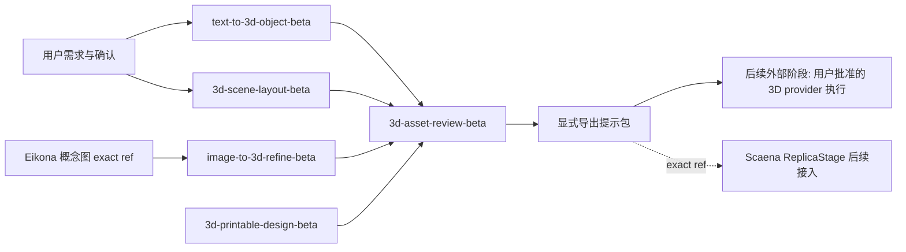

# 3D 模型模板类别设计

## 决策

1. **纯 Prompt 起步**：本 change 只交付可编译模板、recipe 与 taxonomy，不新建 text-to-3D provider adapter，不修改 Scaena/Anatomia/Eikona。理由：3D 资产的 canonical owner 已定为 Scaena，但 ReplicaStage 实现未完成；先让 Prompt 语义层可被任何消费方以 exact ref 发现，执行接入走后续 additive change。
2. **场景字段通用化**：`3d-scene-layout-beta` 输出 provider-neutral 的空间字段（物体、相对位置、尺度锚点、相机占位），不直接耦合 `SceneGEO` schema；Scaena 兼容映射作为后续 change，避免模板契约跟随 Scaena 契约演进被迫 major 升级。
3. **beta 先行**：5 个 solution 全部以 `-beta` ID 与 exploratory maturity 进入，转正按仓库版本命名约定（去后缀、版本重置 `1.0.0`、CLI 重放 metadata）。

## 边界

- 结构化资产（`solution.json`、`catalog.json`、recipe、document descriptor）通过 Registry CLI 创建；英文模板正文与中文审阅文档可人工编辑。
- 模板正文只表达 Prompt 语义：输入变量、输出要求、评审清单、失败模式、rights 与 maturity；不授予工具、凭据、费用或发布权限。
- 编译期 `provider_calls=0`；普通输出不含模板正文、用户值或凭据。
- 3D 执行、candidate、production override 与 frozen asset 状态仍归 Scaena；空间感知证据归 Anatomia；概念图生成归 Eikona。

recipe `concept-to-3d-asset-beta` 表达上图中 Eikona 概念图 → 图生 3D → 评审 → 导出的 DAG；步骤只引用 exact `locale=en` template ref，失效传播与依赖循环由 Registry 编译期校验。

## Solution 设计要点

### text-to-3d-object-beta（文生 3D 单物体）

- **输入变量**：`subject`（主体描述）、`purpose`（game/print/background）、`style`（风格锚点）、`poly_budget`（面数级别：low/mid/high/unspecified）、`symmetry`（对称性约束）、`material_notes`（材质与表面说明，可选）。
- **输出**：provider-neutral 文生 3D 提示包：主体一句话定义、结构分解（部件与比例）、拓扑用途声明、不可见面处理约定。
- **评审清单**：主体是否唯一明确；用途与面数级别是否匹配；风格锚点是否可验证。
- **失败模式**：多主体混入；用途缺失；把 provider 专有语法写进模板正文。

### image-to-3d-refine-beta（图生 3D 精修）

- **输入变量**：`reference_image_ref`（Eikona 产物 exact ref，只引用不复制正文）、`view_strategy`（多视角/单视角推测）、`occlusion_policy`（背面与遮挡推测策略）、`consistency_targets`（必须保持的特征清单）。
- **输出**：图生 3D 提示包 + `multi_view_consistency` 约束声明 + 不可见面推测的显式标注。
- **评审清单**：参考图 ref 可解析；推测内容与可见内容明确分离；一致性特征可逐项核对。
- **失败模式**：把推测当事实；参考图正文泄露进日志或 evidence。

### 3d-scene-layout-beta（场景布局）

- **输入变量**：`objects`（物体清单与角色）、`relations`（相对位置/朝向）、`scale_anchor`（尺度锚点，可空）、`camera_seeds`（相机占位，可选）。
- **输出**：通用空间字段布局描述；无尺度锚点时显式标记相对比例，不用米制「1:1」表述。
- **评审清单**：物体无 unnamed 占位；关系无矛盾（如 A 在 B 左且 B 在 A 左）；尺度声明完整。
- **失败模式**：隐式尺度假设；与 SceneGEO 字段名直接耦合。

### 3d-printable-design-beta（3D 打印约束）

- **输入变量**：`wall_thickness`、`support_strategy`、`tolerance`、`print_orientation`、`material`（可选）。
- **输出**：检查清单式提示包，逐条覆盖 `manifold_geometry`、壁厚、支撑、公差、成型方向。
- **评审清单**：每条约束可机器或人工打勾；无量纲混用。
- **失败模式**：约束写成建议而非可判定条目。

### 3d-asset-review-beta（资产评审）

- **输入变量**：`asset_ref`（候选资产引用）、`intended_use`、可选 `scene_context_ref`。
- **输出**：四类评审清单：几何完整性、UV/贴图、比例一致性、`rights_review`。
- **评审清单**：即模板本体；每项带 pass/fail/unknown 三态。
- **失败模式**：清单项不可判定；把评审结论写成执行指令。

## recipe：concept-to-3d-asset-beta

DAG：`concept-image`（Eikona 概念图，external ref 输入）→ `image-to-3d`（引用 `image-to-3d-refine-beta`）→ `asset-review`（引用 `3d-asset-review-beta`）→ `export`（显式导出提示包）。

- 概念图步骤输出未接受前，图生 3D 步骤保持 `needs_step_output`，不编造中间产物。
- 上游确认撤销时，下游按 DAG 失效传播。
- recipe 不内嵌任何模板正文，只持 exact ref 与 digest。

## taxonomy 增量

| 类别 | 新增值 | 用途 |
| --- | --- | --- |
| category | `3d` | 一级类别：3D 模型与空间资产 |
| modality | `3d` | 3D 模型与空间资产方案 |
| artifact | `model_3d`、`scene_layout` | 单物体模型、场景布局产物 |
| constraint | `manifold_geometry`、`scale_anchored`、`multi_view_consistency` | 几何可制造性、尺度锚点、多视角一致性 |
| capability | `model3d`、`scene_spatial` | provider-neutral 粗粒度能力，不用项目名 |

## 验证

- `catalog build` / `catalog validate` 确定通过；contract、document descriptor 与 recipe DAG 校验必填字段、来源、依赖循环与失效传播。
- 编译演练：缺字段拒绝、未确认拒绝、中文 locale 不可编译、成功导出、替换主题后可建立独立会话复用；`provider_calls=0`。
- 中文译文与英文模板变量 parity 校验。
- 测试使用虚构输入，evidence 只报告计数与引用。

## 风险与缓解

- **无真实 provider 验证**：全部 solution 保持 exploratory maturity，文档不宣称生成质量；转正前必须有真实执行证据。
- **场景字段与 Scaena 漂移**：模板侧字段保持通用并冻结命名；映射层后续独立演进，必要时由映射层 major 升级吸收差异。
- **类别膨胀**：`3d` 类首批固定 5 个 solution；新增同义入口前必须先查现有资产，按 integration-designer 的「能扩展就不新建」原则评审。

## 外部阶段

真实 3D provider 调用、费用、与 Scaena `SceneGEO`/`ReplicaStage` 的字段映射、正式转正与消费方接入均为后续阶段，须另行批准；未完成前所有 solution 保持 exploratory maturity，文档不宣称已验证的生成质量。
