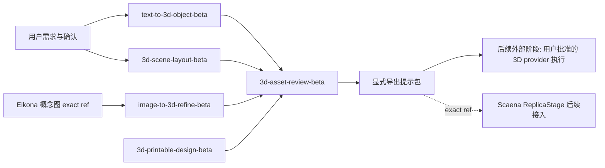

# 3D 模型模板类别设计

## 决策

1. **纯 Prompt 起步**：本 change 只交付可编译模板、recipe 与 taxonomy，不新建 text-to-3D provider adapter，不修改 Scaena/Anatomia/Eikona。理由：3D 资产的 canonical owner 已定为 Scaena，但 ReplicaStage 实现未完成；先让 Prompt 语义层可被任何消费方以 exact ref 发现，执行接入走后续 additive change。
2. **场景字段通用化**：`3d-scene-layout-beta` 输出 provider-neutral 的空间字段（物体、相对位置、尺度锚点、相机占位），不直接耦合 `SceneGEO` schema；Scaena 兼容映射作为后续 change，避免模板契约跟随 Scaena 契约演进被迫 major 升级。
3. **beta 先行**：5 个 solution 全部以 `-beta` ID 与 exploratory maturity 进入，转正按仓库版本命名约定（去后缀、版本重置 `1.0.0`、CLI 重放 metadata）。

## 边界

- 结构化资产（`solution.json`、`catalog.json`、recipe、document descriptor）通过 Registry CLI 创建；英文模板正文与中文审阅文档可人工编辑。
- 模板正文只表达 Prompt 语义：输入变量、输出要求、评审清单、失败模式、rights 与 maturity；不授予工具、凭据、费用或发布权限。
- 编译期 `provider_calls=0`；普通输出不含模板正文、用户值或凭据。
- 3D 执行、candidate、production override 与 frozen asset 状态仍归 Scaena；空间感知证据归 Anatomia；概念图生成归 Eikona。

recipe `concept-to-3d-asset-beta` 表达上图中 Eikona 概念图 → 图生 3D → 评审 → 导出的 DAG；步骤只引用 exact `locale=en` template ref，失效传播与依赖循环由 Registry 编译期校验。

## taxonomy 增量

| 类别 | 新增值 | 用途 |
| --- | --- | --- |
| modality | `3d` | 3D 模型与空间资产方案 |
| artifact | `model_3d`、`scene_layout` | 单物体模型、场景布局产物 |
| constraint | `manifold_geometry`、`scale_anchored`、`multi_view_consistency` | 几何可制造性、尺度锚点、多视角一致性 |
| capability | `model3d`、`scene_spatial` | provider-neutral 粗粒度能力，不用项目名 |

## 验证

- `catalog build` / `catalog validate` 确定通过；contract、document descriptor 与 recipe DAG 校验必填字段、来源、依赖循环与失效传播。
- 编译演练：缺字段拒绝、未确认拒绝、中文 locale 不可编译、成功导出、替换主题后可建立独立会话复用；`provider_calls=0`。
- 中文译文与英文模板变量 parity 校验。
- 测试使用虚构输入，evidence 只报告计数与引用。

## 外部阶段

真实 3D provider 调用、费用、与 Scaena `SceneGEO`/`ReplicaStage` 的字段映射、正式转正与消费方接入均为后续阶段，须另行批准；未完成前所有 solution 保持 exploratory maturity，文档不宣称已验证的生成质量。
