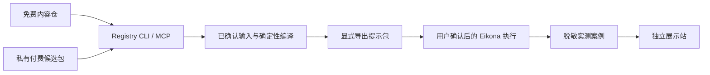

# 视觉探索内容设计

## 边界
新方案采用 beta ID 与 exploratory maturity。结构化资产通过 Registry CLI 创建；英文模板与中文指南可人工编辑。免费说明只授权新包，不修改其他条目。付费候选包在独立私有本地仓，普通日志不包含正文。

## 验证
复用既有 Registry CLI 做本地进程演练：缺字段、未确认、错误 ref、中文编译拒绝、成功导出和第二主题复用。测试使用虚构输入，结果只报告计数与引用；私有导出不进入日志或 evidence。测试脚本运行在本内容 owner，证据由脚本生成。

## 外部阶段
真实模型出图须另行批准运行与费用；试用、真实成交、价格、支付和最终授权文本通过后续实验确定。网页只说明当前证据状态。
